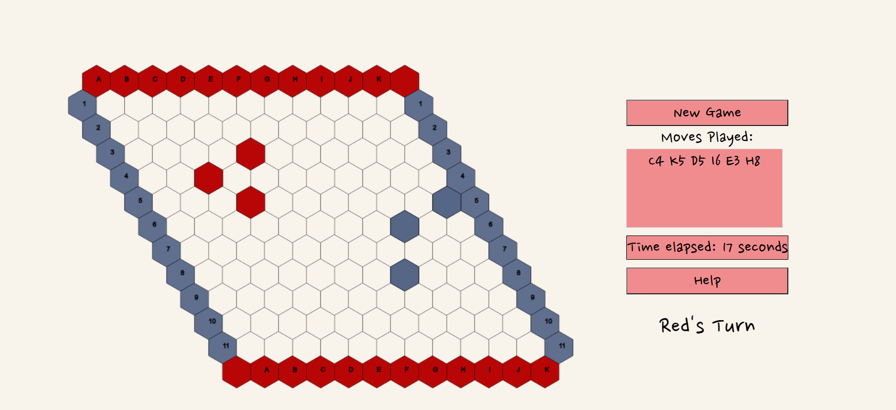

# HEXify!



This game has been created by Bea and Veena as part of our CSE1500 assignment. It is based of the board game Hex where two player places pieces on the board to connect their corresponding colors from one side of the board to the other

Make sure that you have [Node.js](https://nodejs.org/en/) installed

Download the zip file and enter your directory using command prompt. (use cd $filename$ to enter the directory where the game is located

To start the game, execute the following steps in the terminal:

```console
cd hexify
npm install
npm start
```

You can now access the game at [http://localhost:3000/](http://localhost:3000/) in the browser. Open another browser window to access the game as another player.

If you want to change the port two actions are required: 

1. Alter `hexify/package.json` (change the line `node app.js 3000` and replace `3000` with your preferred port).
2. Alter `hexify/public/javascripts/config.js` (the port of the Websocket URL).

A click on the large play button brings you to the game. If you are Player 1, you are the red player. If you are Player 2, you are the blue player.